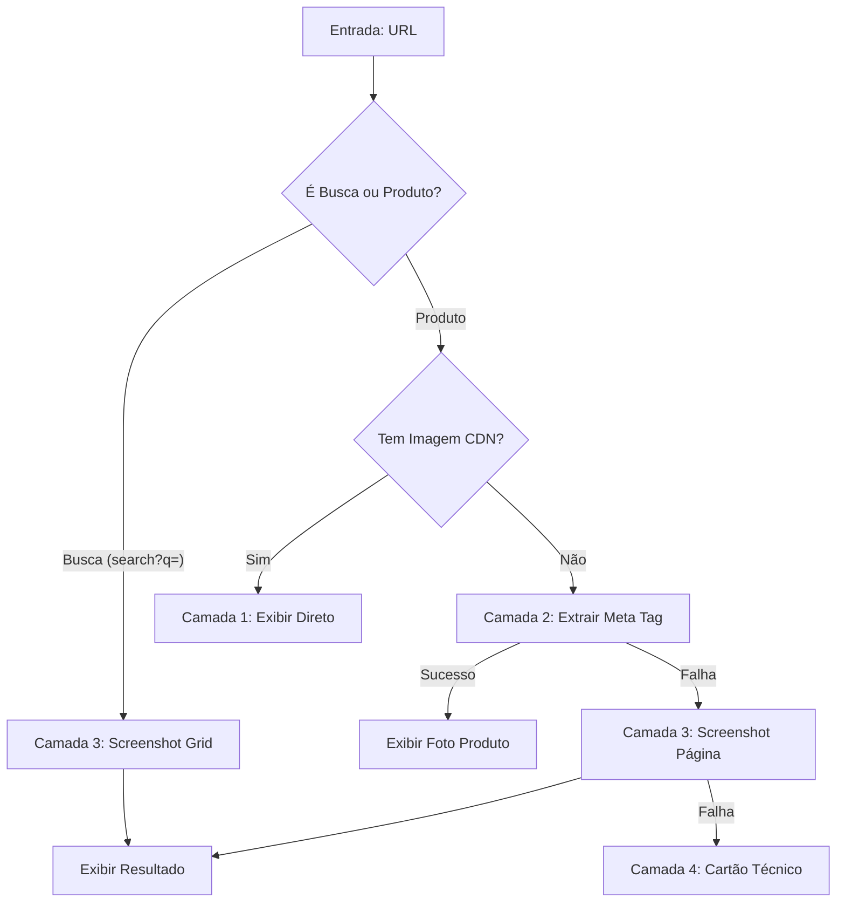

# ARQUITETURA DE CAPTURA VISUAL STEALTH (VINGI AI)

Este documento define o mecanismo técnico para capturar screenshots e imagens reais de sites protegidos (como Etsy, Mood Fabrics, Burda) simulando perfeitamente um usuário humano para evitar CAPTCHAs e bloqueios.

## 1. Visão Geral da Solução (Pipeline de 4 Camadas)

O sistema utiliza uma abordagem em cascata rigorosa para garantir que uma IMAGEM REAL seja exibida. Ícones e Favicons são estritamente proibidos.

### Camada 1: Direct CDN (Proxy)
Se a IA retornar uma URL de imagem direta válida (ex: `i.etsystatic.com/...jpg`), o sistema a utiliza imediatamente, passando por um proxy de alta performance (`wsrv.nl`). Prioridade máxima.

### Camada 2: Open Graph Meta Extraction (Product Pages)
Para páginas de produtos específicos, o sistema extrai a tag `og:image`. Isso retorna a foto principal definida pelo lojista.
*   **Regra de Exceção:** Se a URL for identificada como uma **Página de Busca** (ex: `/search?q=`), esta camada é PULADA para evitar a captura de logotipos genéricos.

### Camada 3: Stealth Screenshot (Search Pages & Fallback)
Se for uma página de busca ou se a Camada 2 falhar, o sistema ativa o Screenshot Stealth.
*   **Vitrine Virtual:** Em páginas de busca, isso captura o grid de resultados, permitindo ao usuário ver várias opções.
*   **Sanitização:** Remove banners de cookies, popups e anúncios (via CSS injection) antes da captura.

### Camada 4: Fallback Técnico (Cartão Profissional)
Se todas as camadas visuais falharem, exibe um "Envelope de Molde" técnico desenhado em CSS. Nunca exibe ícones de site.

---

## 2. Fluxo de Decisão Visual



---

## 3. Especificação Técnica Anti-Bloqueio

### A. Configuração do Navegador (Fingerprint)
*   **Engine:** Playwright (Chromium).
*   **Viewport:** `1280x800` (Laptop) - Ideal para grids de e-commerce.
*   **User-Agent:** Rotativo (Chrome v120+).

### B. Técnicas de Limpeza (CSS Injection)
Antes de tirar o screenshot, o sistema injeta CSS para ocultar:
*   `#onetrust-banner-sdk` (TrustArc)
*   `.wt-overlay` (Etsy)
*   `#gdpr-single-choice-overlay` (Burda/German Sites)
*   `.cookie-banner`
*   `header`, `nav` (Opcional, para focar no conteúdo)

---

## 4. Implementação (Node.js + Playwright Stealth)

Exemplo do script de captura otimizado para a Camada 3:

```javascript
const { chromium } = require('playwright-extra');
const stealth = require('puppeteer-extra-plugin-stealth');

chromium.use(stealth());

async function captureStealthScreenshot(url) {
    // ... setup browser ...
    
    // Ocultar GDPR e Popups
    await page.addStyleTag({ content: `
        #onetrust-banner-sdk, .wt-overlay, #gdpr-single-choice-overlay, 
        .cookie-banner, [aria-label="cookie consent"], .popup-overlay { 
            display: none !important; 
        }
    `});

    // Aguardar Lazy Load
    await page.evaluate(async () => {
        window.scrollBy(0, 500);
        await new Promise(resolve => setTimeout(resolve, 1000));
    });

    // Captura
    await page.screenshot({ path: 'screenshot.jpg' });
}
```
